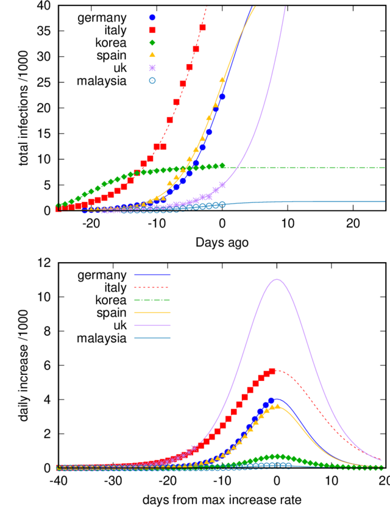

rms of residuals      (FIT_STDFIT) = sqrt(WSSR/ndf)    : 733.884
variance of residuals (reduced chisquare) = WSSR/ndf   : 538586

Final set of parameters            Asymptotic Standard Error
=======================            ==========================
L6              = 179619           +/- 1.543e+04    (8.591%)
k6              = 0.335365         +/- 0.01022      (3.049%)
x06             = 64.4821          +/- 0.4619       (0.7164%)

correlation matrix of the fit parameters:
                L6     k6     x06    
L6              1.000 
k6             -0.925  1.000 
x06             0.996 -0.947  1.000 
Warning: empty y range [83:83], adjusting to [82.17:83.83]
Warning: empty y range [60:60], adjusting to [59.4:60.6]
Warning: empty y range [77:77], adjusting to [76.23:77.77]
Warning: empty y range [47:47], adjusting to [46.53:47.47]
Warning: empty y range [67:67], adjusting to [66.33:67.67]
Warning: empty y range [328:328], adjusting to [324.72:331.28]
Warning: empty y range [328:328], adjusting to [324.72:331.28]
"/dev/fd/63" line 123: Cannot open script file 'multi.gnu'

# COVID-19-plots

Here is some regularly updated analysis of the COVID-19 outbreak.

Data from: https://github.com/CSSEGISandData/COVID-19

 *UPDATED: Fri 27 Mar 2020 08:05:17 AM CET*

## The growth rate of infection

Data are provided for number of the number of _cumulated infected_, _recovered_ and _deceased_ patients.
We first consider the number of infected people. With a constant infection rate and an infinite
reservoir of infectable people,  this number should grow nearly exponentially. Therefore, we plot
the data on a linear x-axis and a logarithmic y-axis. In this way an exponential growth of the
infections shows up as straight lines. 

We see in the top figure, the infection data for 6 different countries. Most of them do not show
straight lines over the entire range. The relative infection rate can be calculated by dividing the
daily increase by the number of infections. However, as the data scatter, also these numbers scatter
significantly and trends are difficult to grasp. Therefore, we fit polynomials of 4th order to the
logarithm of the infections. The 1st derivative of these polynomials mark the effective
infection rates and are plotted as solid lines in the lower plot. Note, one should not overinterpret
the data, since small fluctuations in the data get picked up by the fits and thus show unreal
trends. However, one can clearly see, how the infection rates in Italy decrease albeit slowly,
steadily.

_doubling_table

## Logisitc function
The number of infected agents during a pandemic often follow a [logistic function](https://en.wikipedia.org/wiki/Logistic_function).
The number of infected agents increases initially exponentially, as long as most of the population
is not infected yet. When the infection rate increases, it will be more difficult for the virus to
find fresh (not infected) hosts and the slope of the curve decreases. The curve reaches its
inflection point when roughly half of the population is infected and after finally reaches
asymptotically a constant value, i.e., uninfected hosts are so rare that the virus can no longer
spread. 

The COVID-19 pandemic is however different, as the infection rates are not so much controlled by the
progress of the infections, but rather by the measures the societies are taken to slow down the
outbreak. Nevertheless, fitting a logisitic function to the data might help to detect changes in the
spreading rate and hence whether measures are working.

_logistic_table

## Currently infected

For the health systems, the number of active cases is also important. Below, we plot the number of normalised by the population of ad given country (in person per millions - ppm).

