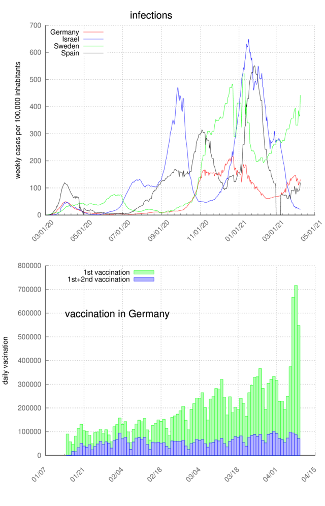

# COVID-19-plots

These are some bash and gnuplot scripts to analyse various covid-19. 

It is quite amazing how easy it is to get data during the covid pandemic. One can data of invections, deaths, recovered and vaccinated people from various countries, states and counties. I analyse (plot) some of these data using gnuplot and simple bash scripts. 

