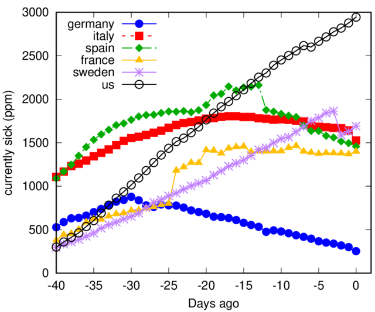
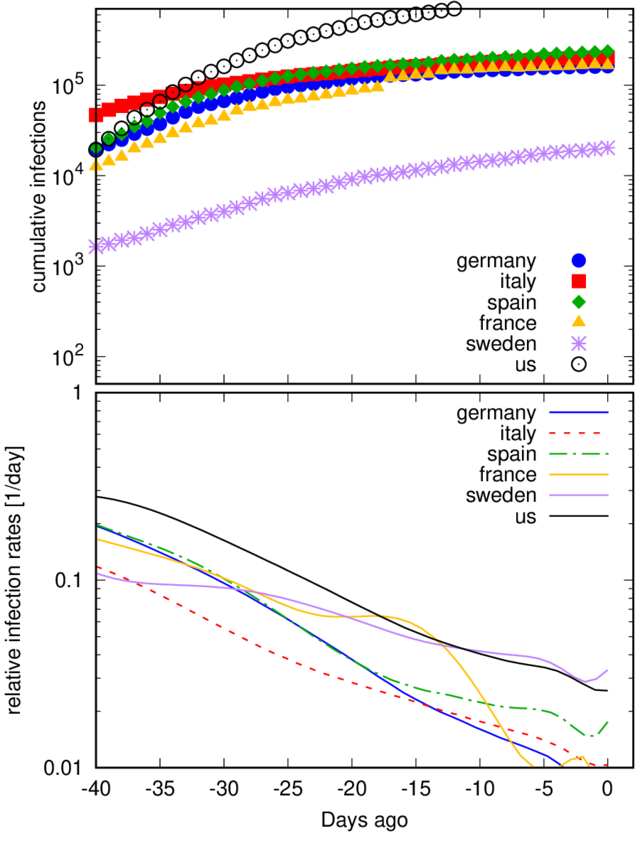

# COVID-19-plots

Here is some regularly updated analysis of the COVID-19 outbreak.

Data from: https://github.com/CSSEGISandData/COVID-19

 *UPDATED: Sun 17 May 2020 02:28:11 PM CEST*

Data are provided for number of the number of _cumulated infected_, _recovered_ and _deceased_ patients.

## Currently infected

Let's first have a look at the currently sick people, i.e., the cumulated infected people minus the
deaths and recovered patients. This number is certainly important for the health systems and thus we
normalise them by the population. Not that this normalisation is still not sufficient, e.g., when
the infections mainly occur in a rather small area of a countr. We plot the number of normalised by the population of ad given country (in person per millions - ppm).

## The growth rate of infection

We first consider the number of infected people. With a constant infection rate and an infinite
reservoir of _infectable_ people. This number should grow initially nearly exponentially without
proper countermeasures. We plot the data on a linear x-axis and a logarithmic y-axis. In this way an exponential growth of the infections shows up as straight lines. 

We see in the top figure, the infection data for 6 different countries. Most of them do not show
straight lines over the entire range. We calculate the relative infection rate from smoothed and
interpolated infection data in order to remove the scatter of the data. 

*Infection rates doubled in :*
|Country | days until doubling of infections| 
| --- | --- |
|germany |208.13 days|
|italy |181.06 days|
|spain |272.38 days|
|france |718.98 days|
|sweden |37.88 days|
|us |39.68 days|

*Please note that I have removed the logistic fits, as they are at this point of the pandemic not
very useful. The logistic curve only models the pandemic well when no measures
are taken. The measures that were taken and the change of the restrictions makes a good long term
projection impossible and we therefore refrain from doing so.*
