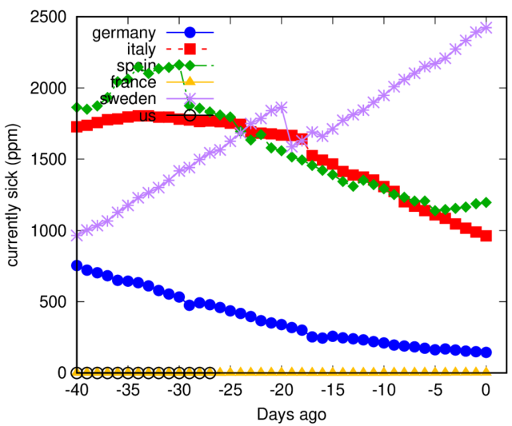
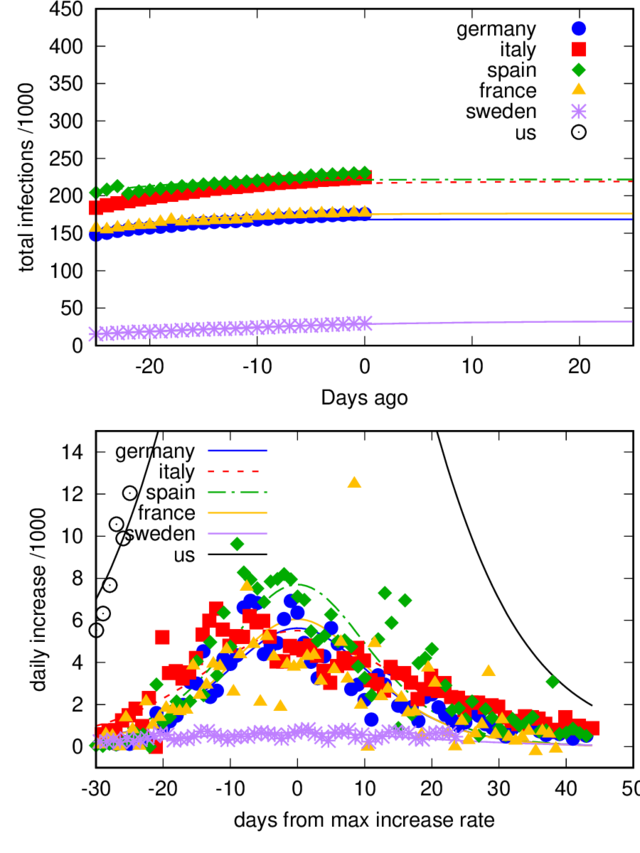

# COVID-19-plots

Here is some regularly updated analysis of the COVID-19 outbreak.

Data from: https://github.com/CSSEGISandData/COVID-19

 *UPDATED: Sat 18 Apr 2020 05:32:32 PM CEST*

Data are provided for number of the number of _cumulated infected_, _recovered_ and _deceased_ patients.

## Currently infected

Let's first have a look at the currently sick people, i.e., the cumulated infected people minus the
deaths and recovered patients. This number is certainly important for the health systems and thus we
normalise them by the population. Not that this normalisation is still not sufficient, e.g., when
the infections mainly occur in a rather small area of a countr. We plot the number of normalised by the population of ad given country (in person per millions - ppm).

## The growth rate of infection

We first consider the number of infected people. With a constant infection rate and an infinite
reservoir of _infectable_ people. This number should grow initially nearly exponentially without
proper countermeasures. We plot the data on a linear x-axis and a logarithmic y-axis. In this way an exponential growth of the infections shows up as straight lines. 

We see in the top figure, the infection data for 6 different countries. Most of them do not show
straight lines over the entire range. We calculate the relative infection rate from smoothed and
interpolated infection data in order to remove the scatter of the data. 

*Infection rates doubled in :*
|Country | days until doubling of infections| 
| --- | --- |
|germany |27.67 days|
|italy |33.28 days|
|spain |20.87 days|
|france |20.71 days|
|sweden |13.54 days|
|us |14.76 days|

## Logisitc function
The number of infected agents during a pandemic often follow a [logistic function](https://en.wikipedia.org/wiki/Logistic_function).
The number of infected agents increases initially exponentially, as long as most of the population
is not infected yet. When the infection rate increases, it will be more difficult for the virus to
find fresh (not infected) hosts and the slope of the curve decreases. The curve reaches its
inflection point when roughly half of the population is infected and after finally reaches
asymptotically a constant value, i.e., uninfected hosts are so rare that the virus can no longer
spread. 

The COVID-19 pandemic is however different, as the infection rates are not so much controlled by the
progress of the infections, but rather by the measures the societies are taken to slow down the
outbreak. Nevertheless, fitting a logisitic function to the data might help to detect changes in the
spreading rate and hence whether measures are working.

Top: Data with logistic curve fits. 
Bottom: The derivative of the logistic curve (i.e., the daily increases) as lines, and the real
increases as data points.

*Max expected total infections:*
|Country | total | in persons per million | 
| --- | ---- | ---- |
|germany| 143816 +/- 1309| 1732.7 +/- 15.8|
|italy| 174664 +/- 2276| 2911.1 +/- 37.9|
|spain| 189157 +/- 2142| 4024.6 +/- 45.6|
|france| 232946 +/- 22391| 3476.8 +/- 334.2|
|sweden| 18225 +/- 452| 1822.6 +/- 45.2|
|us| 783510 +/- 12339| 2388.8 +/- 37.6|

## Another fit

As pointed out, the logisitc function represents the data well only, when no interventions are
taken place, or under a complete shutdown. However, it is likely that certain societies decide to
accept a slow, constant increase of cases, small enough for the health systems to deal with. Many
countries, including South Korea show a slow linear increase of the accumulated infections.
Therefore, we also try a fit of the function: I(t) = (a+b*t)/(1+exp(-c*t)) 

